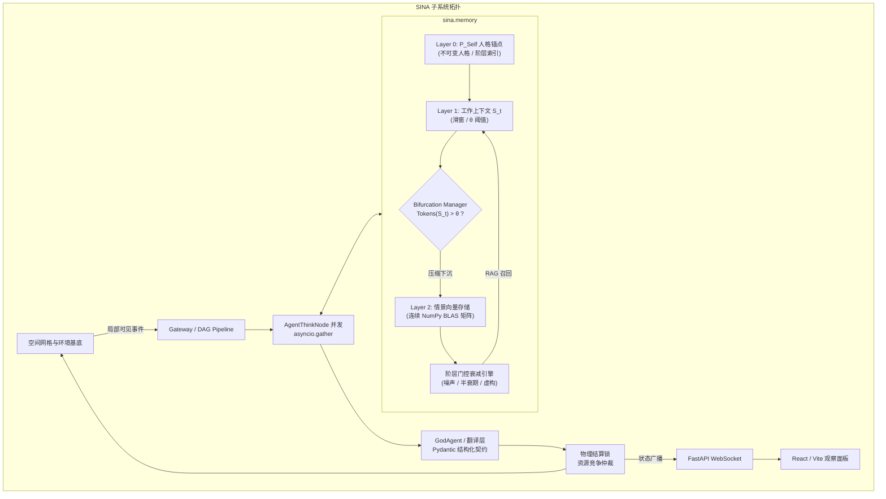

# SINA (Sociological & Introspective Neural Architecture)

[](LICENSE)
[](https://www.python.org/)
[](https://fastapi.tiangolo.com/)
[](https://react.dev/)

> **状态**：v4（公开核心引擎） · 单人项目，仍在活跃开发
> **技术栈**：FastAPI · NumPy · React/Vite · Obsidian

SINA 是一个多智能体社会模拟引擎。它不把多智能体系统当成提示词链或聊天壳，而是当成**受物理与算力约束的分布式系统**来建模：智能体只能感知自己所在房间发生的事，资源有限，记忆随阶层衰减，任何动作都要经过统一的物理结算才能改变世界状态。

这是一个个人研究项目——约 8k 行 Python 加一套 React 前端。它能完整跑通单步与自动推演循环，但**不是开箱可用的产品**：需要自备 LLM API key，接口与存档格式仍在变动。如果想先了解它的边界，请直接看文末的[已知限制](#-已知限制)。

---

## 设计原则

下面四条不是"公理"，而是这个项目选择遵守的建模约束。每条都对应一处具体实现：

| 原则 | 动机 | 实现 |
| :--- | :--- | :--- |
| **认知局部性** | 现实中不存在全局广播，观察者只有有限视野 | 事件只沿空间图的相邻节点传播，跨房间不可见（`sina/environment.py`） |
| **资源稀缺** | 维持认知需要消耗能量与资本 | 记忆保真度受阶层指数门控，低阶层智能体出现衰减与虚构（`ClassGatedDecayEngine`） |
| **反停滞** | 闭环多智能体系统会收敛成互相附和的回声室 | 实时统计认知熵 $H(W)$，按需注入扰动 |
| **有界记忆** | 工作记忆不能随 tick 无限增长 | 超过 token 阈值后自动压缩并下沉到向量存储 |

---

## 系统架构



---

## 核心子系统

### 1. 分层记忆 (`sina.memory`)
* **Layer 0 `PersonaInvariant`**：不可变的人格锚点，防止长 tick 推演中人格漂移。
* **Layer 1 `BifurcationManager`**：实时监控 token 预算。当工作上下文 $S_t > \theta$ 时，把历史切片蒸馏后下沉到 Layer 2，使工作上下文保持有界。
* **Layer 2 `EpisodicVectorStore`**：连续 2D NumPy 矩阵，用单次 BLAS 运算（$Q \cdot M^T$）做批量余弦相似度检索；冷数据持久化到 SQLite。
* **阶层门控衰减 (`ClassGatedDecayEngine`)**：富裕智能体记忆保真度高；低阶层智能体的记忆按半衰期指数衰减，在记忆缺口处生成合理化叙事（即虚构）。

### 2. DAG 并发与物理结算 (`core/`)
* **并行意图生成**：`AgentThinkNode` 并发评估环境刺激。
* **确定性物理结算**：冲突与交互统一经过 `RealityCheckMiddleware` 与 `settlement_engine.py`，拦截跨房间交互、与死者对话、凭空造物等幻觉，不让 LLM 输出直接改写世界状态。

### 3. 空间拓扑与两种观察视图
* **Obsidian 星图 (`sina.observer`)**：把实时模拟状态导出为带双向 `[[wikilinks]]` 与 YAML 元数据的 Markdown 笔记，以及 2D `.canvas` 拓扑。用 Obsidian 打开 `obsidian_vault/`（`Ctrl + G`）即可借用 Obsidian 自带的力导向图查看社群视野与记忆图。
* **Web 面板 (`frontend/`)**：无头模拟状态也可经 WebSocket 推送到 React + Tailwind + Vite 面板，含实时地图拓扑与记忆查看器。

---

## 🚀 快速开始

### 环境要求
* Python 3.11+
* Obsidian（可选，用于星图视图）
* Node.js 18+（可选，用于 Web 面板）

### 1. 安装
```bash
git clone https://github.com/Kayla-Cheung/SINA.git
cd SINA

pip install -r requirements.txt

cp .env.example .env
# 编辑 .env，填入 DEEPSEEK_API_KEY / OPENAI_API_KEY
```

### 2. 跑测试
```bash
pytest sina/tests/ -v
```

### 3. 启动模拟（Obsidian 星图）
```bash
# 第 1 步：打开 Obsidian → "Open folder as vault" → 选择 obsidian_vault/ 目录
# 第 2 步：在 Obsidian 中按 Ctrl + G（全局图谱），或打开 World_Canvas.canvas
# 第 3 步：启动交互式离散模拟
python sandboxes/run_obsidian_simulation.py
```

### 4. 备选：启动 Web 服务与面板
```bash
# 终端 1：启动后端引擎（仓库根目录，或 cd core && python server.py）
python core/server.py

# 终端 2：启动前端面板
cd frontend
npm install
npm run dev
```

打开 Vite 输出的地址（默认 http://localhost:5173）。填入对话模型 API key 后点击 **Create Game**。面板不会自动开始推演，需要你先新建或继续一个存档。

用 **Step** / **Auto-step** 推进已有的 DAG tick 循环：每步会等该 tick 全部完成（含 LLM 调用）后才刷新地图。存档每 tick 后自动写入 `data/saves/`；**Export** 导出的 JSON 与 **Import save JSON** 接受的格式一致。

没有 API key 时，创建/单步在 HTTP 层仍可运行，智能体决策会走引擎内置的兜底逻辑。

---

## 场景配置

`worlds/` 下带有两个可直接运行的示例场景（`smallville`、`stone_age`），各自包含 `agents.json`、`map.json`、`physics.json`、`prompt.json`。想换场景，改这四份配置即可，核心引擎无需改动。

注意：密钥只放在 `.env`（已被 `.gitignore` 忽略）。`worlds/` 与 `obsidian_vault/` 下的内容本身是**会**进版本库的，如果要带私有剧本，请自行加进 `.gitignore`。

---

## ⚠️ 已知限制

* **单人项目**：无外部贡献者，接口与存档格式可能随版本变动。
* **需要自备 LLM**：所有智能体决策依赖外部 API，跑一次完整推演有实际 token 成本。
* **后端测试较完整，前端没有**：后端 `pytest sina/tests/ -v` 共 123 个用例，覆盖记忆层级、DAG 调度、物理结算、存档往返、观察器导出与若干边界情况；`frontend/` 没有任何自动化测试。
* **issue 列表尚未清理完毕**：多为接口一致性、存档迁移与边界情况。
* **性能未做基准测试**：规模上限（智能体数 × tick 数）还没有系统测量数据。
